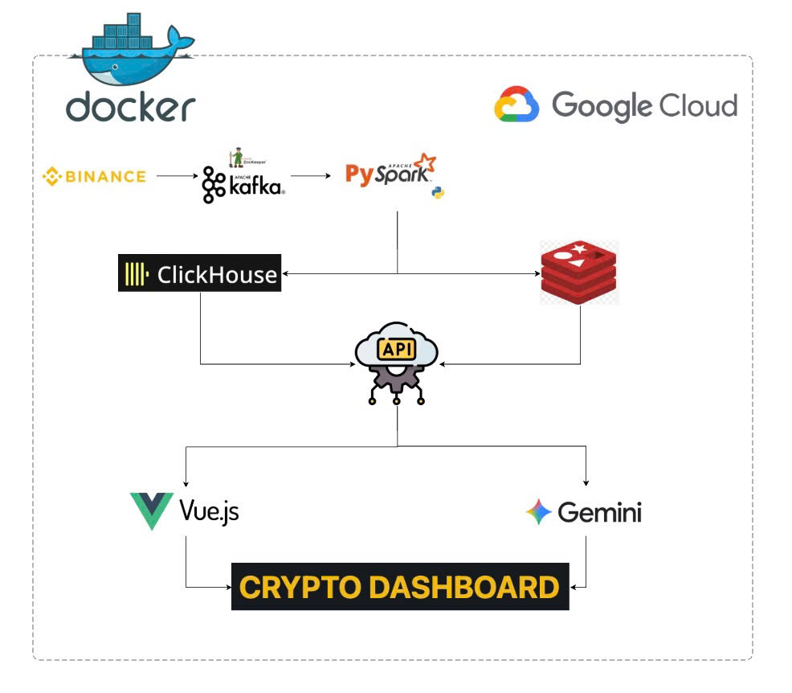

# 🚀 Real-time Crypto Trading & Analytics Platform

## 📖 Tổng quan dự án

**Real-time Market Analytics** là hệ thống mô phỏng sàn giao dịch cryptocurrency tích hợp xử lý dữ liệu BigData thời gian thực và phân tích narrative bằng AI. Dự án bao gồm:

- ⚡ **Real-time Data Pipeline**: Thu thập & xử lý dữ liệu từ Binance WebSocket
- 🔄 **Matching Engine**: Mô phỏng bộ khớp lệnh P2P với Lua Scripts trên Redis
- 📊 **Big Data Processing**: Spark Structured Streaming với ClickHouse storage
- 🤖 **AI Narrative Analysis**: Gemini 2.5 Flash phân tích tin tức và biến động thị trường
- 🎯 **Trading Dashboard**: Giao diện React với WebSocket real-time
- 📈 **Market Data**: Orderbook, Trades, Klines, Tickers

---

## 🏗️ Kiến trúc hệ thống



---

## 🛠️ Tech Stack

### **Backend & Processing**
- **FastAPI** - REST API & WebSocket server
- **Apache Spark 3.5** - Structured Streaming
- **Redis** - Hot cache & order matching
- **ClickHouse** - Time-series data warehouse

### **Message Queue & Streaming**
- **Apache Kafka** - Distributed event streaming
- **Zookeeper** - Kafka coordination

### **AI/ML**
- **Google Gemini 2.5 Flash** - Market narrative analysis
- **LangChain** (optional) - Future GraphRAG integration

### **Frontend**
- **React 18** - UI framework
- **TradingView Lightweight Charts** - Price charts
- **WebSocket** - Real-time updates

### **DevOps**
- **Docker & Docker Compose** - Containerization
- **Nginx** - Web server
- **Python 3.11** - Primary language

---

## 🚀 Hướng dẫn cài đặt

### **Yêu cầu hệ thống**
- Docker Desktop (>=20.10)
- Docker Compose (>=2.0)
- RAM: 8GB+ (khuyến nghị 16GB)
- Disk: 10GB+ free space

### **Bước 1: Clone repository**
```bash
git clone https://github.com/ngocbao220/realtime-market-analytics.git
cd realtime-market-analytics
```

### **Bước 2: Cấu hình API Key (AI Narrative)**
Tạo file `.env` hoặc sửa trong `docker-compose.yml`:
```env
GEMINI_API_KEY=your_gemini_api_key_here
```

### **Bước 3: Khởi động hệ thống**
```bash
docker-compose up -d
```
### **Bước 4: Kiểm tra trạng thái**
```bash
docker-compose ps
```


### **Bước 5: Truy cập ứng dụng**

| Service | URL | Description |
|---------|-----|-------------|
| **Trading Dashboard** | http://localhost:3000 | Main user interface |
| **API Docs** | http://localhost:8000/docs | FastAPI Swagger UI |
| **Spark Master UI** | http://localhost:8080 | Spark cluster monitoring |
| **Kafka UI** | http://localhost:8085 | Kafka topics & messages |
| **Redis Commander** | http://localhost:8088 | Redis data viewer |
| **ClickHouse** | http://localhost:8123 | Database interface |

---

## 👤 Tài khoản mặc định

### **Admin Account**
- **Username**: `admin`
- **Password**: `admin123`
- Quyền: Quản lý user, xem tất cả lệnh, lịch sử giao dịch

### **Test User**
- **Username**: `testuser`
- **Password**: `test123`
- Balance: 10,000 USDT + 1 BTC

---

##  Tính năng chính

### 🔹 **Trading Features**
- ✅ Đặt lệnh mua/bán (Limit Order)
- ✅ Hủy lệnh chờ khớp
- ✅ Xem sổ lệnh real-time (Order Book)
- ✅ Lịch sử giao dịch cá nhân
- ✅ Biểu đồ giá TradingView

### 🔹 **Data Pipeline**
- ✅ Thu thập 5 cặp tiền: BTC, ETH, SOL, BNB, DOGE
- ✅ Xử lý 1M+ events/phút
- ✅ Lưu trữ ClickHouse với retention policy
- ✅ Cache Redis cho low-latency queries

### 🔹 **Matching Engine**
- ✅ P2P order matching với Lua scripts
- ✅ Khớp với Binance market price (fallback)
- ✅ FIFO priority trong cùng price level
- ✅ Tự động cập nhật balance

### 🔹 **AI Narrative**
- ✅ Phân tích biến động giá bất thường (>5%)
- ✅ Tóm tắt tin tức crypto từ Coindesk, Cointelegraph
- ✅ Entity recognition (BTC, ETH, SEC...)
- ✅ Real-time insights trên dashboard

---


## 📈 Monitoring & Logs

### **Xem logs**
```bash
# Tất cả services
docker-compose logs -f

# Service cụ thể
docker-compose logs -f api
docker-compose logs -f spark-submit
docker-compose logs -f worker
```

### **ClickHouse queries**
```bash
docker exec -it clickhouse clickhouse-client \
  --user=default --password=12345

# Queries ví dụ
SELECT count() FROM trades;
SELECT * FROM tickers ORDER BY timestamp DESC LIMIT 10;
```

### **Redis CLI**
```bash
docker exec -it redis redis-cli

# Commands
KEYS *
GET market:BTCUSDT:ticker
ZRANGE orderbook:virtual:BTCUSDT:bids -10 -1 WITHSCORES
```


## 🤝 Contributing

Contributions are welcome! Please follow these steps:

1. Fork repository
2. Create feature branch (`git checkout -b feature/AmazingFeature`)
3. Commit changes (`git commit -m 'Add AmazingFeature'`)
4. Push to branch (`git push origin feature/AmazingFeature`)
5. Open Pull Request

---


## 📧 Contact

- **Author**: Ngoc Bao (Leader) Manh Cuong Quang Anh
- **GitHub**: [@ngocbao220](https://github.com/ngocbao220)
- **Repository**: [realtime-market-analytics](https://github.com/ngocbao220/realtime-market-analytics)

---
